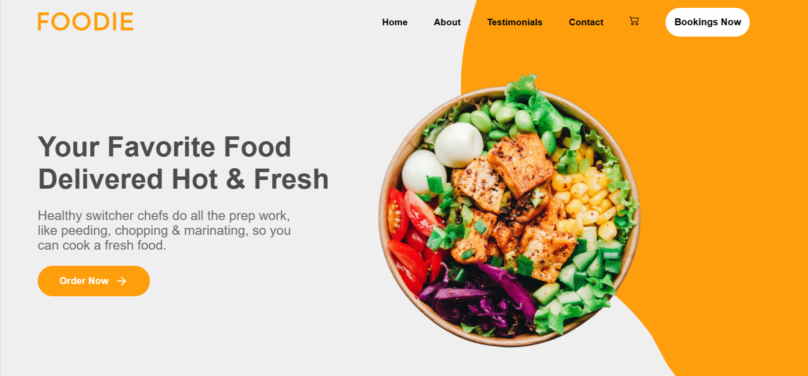

<div align="center">
  <a href="https://foodie-cm.netlify.app/" target="_blanck"></a>
   <div align="center">
     
     
   </div>
  <h3 align="center">Foodie</h3>
</div>

## <br /> 📋 <a name="table">Summary</a>

- ✨ [Introduction](#introduction)
- 🛠 [Technology Used](#tech-stack)
- 🚀 [Launch App](#launch-app)
- 🎨 [Styling](#style)

## <br /> <a name="introduction">✨ Introduction</a>

**[ENG]** Foodie is a fully responsive landing page built with JavaScript and React, designed for a healthy food delivery restaurant. The website ensures a seamless and engaging user experience across all devices.

For an enhanced UI, React Icons is used in the mobile sidebar navigation and the work section. The testimonials section features a dynamic, responsive slider built with Swiper.js, allowing users to swipe through comments using swiper-pagination on mobile and swiper-button for tablet and desktop navigation.

Foodie combines modern web technologies with an intuitive interface to deliver a smooth and interactive experience.

**[FR]** Foodie est une landing page entièrement responsive, développée avec JavaScript et React, conçue pour un restaurant de livraison spécialisé dans la nourriture saine. Le site garantit une expérience utilisateur fluide et immersive sur tous les appareils.

Pour une interface optimisée, React Icons est utilisé dans la navigation latérale mobile et la section "work". La section témoignages intègre un slider dynamique et réactif construit avec Swiper.js, permettant aux utilisateurs de faire défiler les avis via swiper-pagination sur mobile et swiper-button sur tablette et ordinateur.

Foodie associe des technologies web modernes à une interface intuitive pour offrir une expérience utilisateur fluide et interactive.

## <br /> <a name="tech-stack">🛠 Technology Used</a>

- [react-icon](https://www.npmjs.com/package/react-icons)
Include popular icons in your React projects easily with react-icons, which utilizes ES6 imports that allows you to include only the icons that your project is using.

- [scriptjs](https://www.npmjs.com/package/scriptjs)
An asynchronous JavaScript loader and dependency manager with an astonishingly impressive lightweight footprint. allows you to load script resources on-demand from any URL and not block other resources from loading (like CSS and images).

## <br /> <a name="launch-app">🚀 Launch App</a>

Follow these steps to set up the project locally on your machine.

**Prerequisites**

>[!NOTE]
> Make sure you have the following installed on your machine:

- [Git](https://git-scm.com/)
- [Node.js](https://nodejs.org/en)
- [npm](https://www.npmjs.com/) *(Node Package Manager)*

**Cloning the Repository**

```bash
git clone {git remote URL}
cd {git project..}
```

**Installation**

> After cloning the repository, run the command `npm i` or `yarn i` to install the project's dependencies.

> Run the development server:

### `npm start`

Runs the app in the development mode.\
Open [http://localhost:3000](http://localhost:3000) to view it in your browser.

The page will reload when you make changes.\
You may also see any lint errors in the console.

### `npm test`

Launches the test runner in the interactive watch mode.\
See the section about [running tests](https://facebook.github.io/create-react-app/docs/running-tests) for more information.

### `npm run build`

Builds the app for production to the `build` folder.\
It correctly bundles React in production mode and optimizes the build for the best performance.

The build is minified and the filenames include the hashes.\
Your app is ready to be deployed!

See the section about [deployment](https://facebook.github.io/create-react-app/docs/deployment) for more information.
